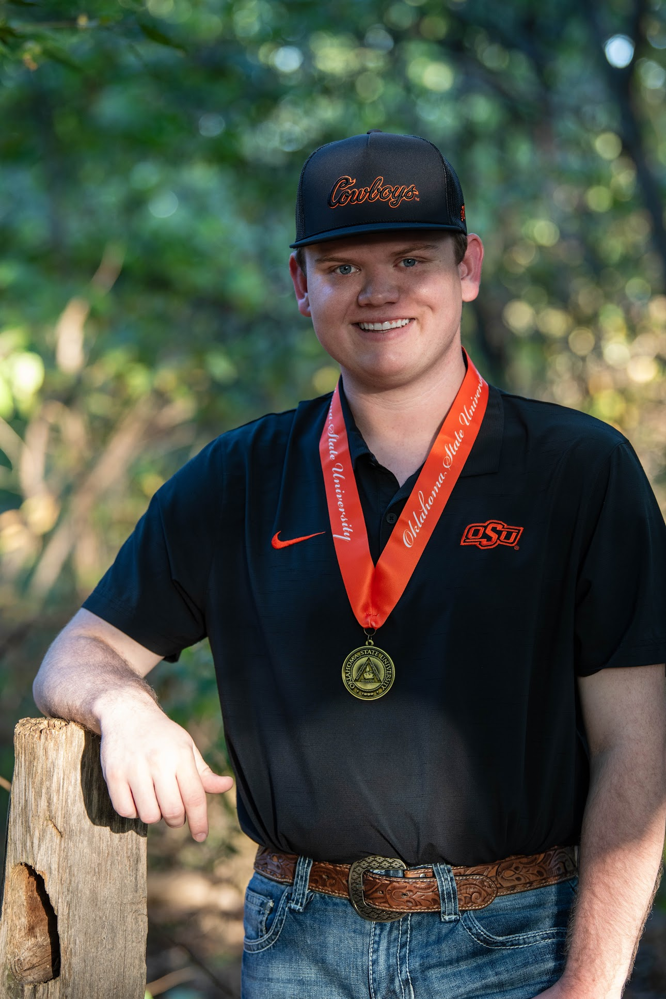

My name is Carson Atwood, and I am a graduate research assistant in the Department of Animal and Food Science at Oklahoma State University. I am currently a second-year Master of Science student in animal science, where my work focuses on the behavior and welfare of growing broiler chickens. My research centers around understanding how social rank shapes behavior, resource use, and performance, with the goal of improving both bird welfare and production outcomes.

{fig-align="center"}
